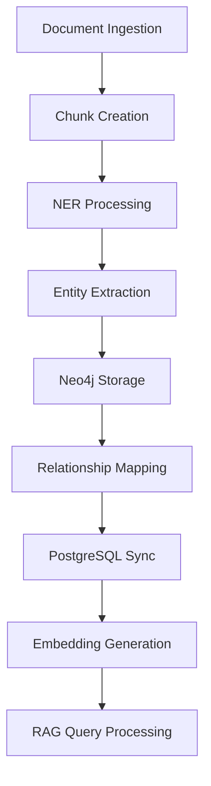

# Neo4j Knowledge Graph Migration Guide

## Overview

This guide provides comprehensive documentation for migrating and setting up the Neo4j knowledge graph for LocalRAG, featuring complete Indonesian Named Entity Recognition (NER) with 20 entity types and optimized relationship patterns.

## Migration Architecture

### Migration Sequence
The Neo4j migration consists of 5 sequential migrations designed for empty Neo4j database:

1. **006_foundation_rebase.cypher** - Foundation infrastructure
2. **007_indonesian_ner_entities.cypher** - 20 Indonesian NER entity types
3. **008_hierarchical_relationships.cypher** - Administrative hierarchy and legal relationships
4. **009_performance_optimization.cypher** - Advanced indexing and query optimization
5. **010_rag_integration.cypher** - RAG pipeline integration

### Rollback Strategy
Comprehensive rollback approach with multiple options:
- **complete_cleanup.cypher** - Universal cleanup script for all scenarios
- **002_cleansing.cypher** - Used by `neo4j clean` command  
- **Individual rollback scripts** (006-010) - For specific migration rollbacks
- Safe rollback with orphaned relationship cleanup and constraint management

## Indonesian NER Entity Schema

### Complete 20 Entity Types

| No. | Code | Type | Description | Examples |
|-----|------|------|-------------|----------|
| 1 | PER | Person | Individual names | Joko Widodo, Megawati |
| 2 | ORG | Organization | General organizations | Universitas Indonesia, Bank BCA |
| 3 | NOR | PoliticalOrganization | Political entities | PDI-P, Golkar |
| 4 | GPE | GeopoliticalEntity | Countries, cities with admin levels | Jakarta, Surabaya |
| 5 | LOC | Location | Non-political locations | Gunung Bromo, Danau Toba |
| 6 | FAC | Facility | Buildings, airports, campuses | Bandara Soekarno-Hatta, Monas |
| 7 | LAW | Law | Legal documents, policies | UU No. 1 Tahun 1945 |
| 8 | EVT | Event | Conferences, concerts | Asian Games 2018 |
| 9 | DAT | Date | Temporal entities | 17 Agustus 1945 |
| 10 | TIM | Time | Time periods, hours | 08:00 WIB, pagi hari |
| 11 | CRD | Cardinal | Numeric values | satu, dua puluh, 100 |
| 12 | ORD | Ordinal | Ordinal numbers | pertama, kedua, ke-10 |
| 13 | QTY | Quantity | Measurements | 5 liter, 10 kilogram |
| 14 | PRC | Percentage | Percentage values | 10 persen, 50% |
| 15 | MON | Money | Currency amounts | Rp 100.000, USD 50 |
| 16 | PRD | Product | Products and services | iPhone 14, Indomie |
| 17 | REG | Religion | Religious entities | Islam, Kristen |
| 18 | WOA | WorkOfArt | Books, songs, paintings | Laskar Pelangi, Bengawan Solo |
| 19 | LAN | Language | Language identifiers | Bahasa Indonesia, Bahasa Jawa |
| 20 | O | Other | Miscellaneous entities | Other/Outside |

### Entity Properties Schema

```cypher
// Base Entity Properties
(:Entity {
    id: String (UUID),
    name: String,
    type: String,
    normalized_name: String,
    aliases: [String],
    confidence: Float,
    frequency: Integer,
    bio_tag: String,
    context: String,
    created_at: DateTime
})

// Specialized Properties by Type
(:GPE {
    admin_level: String  // provinsi, kota, kabupaten, kecamatan, kelurahan, desa, nagari, rw, rt
})

(:Law {
    identifier: String,
    law_type: String  // undang-undang, peraturan_pemerintah, etc.
})

(:Language {
    code: String  // ISO language codes
})

(:Date {
    value: Date
})

(:Time {
    value: String
})

// Quantitative entities
(:Entity where type IN ['QTY', 'PRC', 'MON'] {
    value: Float,
    unit: String,
    currency: String  // for MON type
})
```

## Relationship Patterns

### Indonesian Administrative Hierarchy

```cypher
// Indonesian GPE Administrative Structure
(GPE {admin_level: "provinsi"})-[:CONTAINS]->(GPE {admin_level: "kota"})
(GPE {admin_level: "provinsi"})-[:CONTAINS]->(GPE {admin_level: "kabupaten"})
(GPE {admin_level: "kota"})-[:CONTAINS]->(GPE {admin_level: "kecamatan"})
(GPE {admin_level: "kabupaten"})-[:CONTAINS]->(GPE {admin_level: "kecamatan"})
(GPE {admin_level: "kecamatan"})-[:CONTAINS]->(GPE {admin_level: "kelurahan"})
(GPE {admin_level: "kecamatan"})-[:CONTAINS]->(GPE {admin_level: "desa"})
(GPE {admin_level: "kecamatan"})-[:CONTAINS]->(GPE {admin_level: "nagari"})
(GPE {admin_level: "kelurahan"})-[:CONTAINS]->(GPE {admin_level: "rw"})
(GPE {admin_level: "desa"})-[:CONTAINS]->(GPE {admin_level: "rw"})
(GPE {admin_level: "rw"})-[:CONTAINS]->(GPE {admin_level: "rt"})
```

### Legal Document Relationships

```cypher
// Legal Amendment and Implementation
(LAW)-[:AMENDS {amendment_type: "partial|complete"}]->(LAW)
(LAW)-[:IMPLEMENTS {implementation_type: "regulation|policy"}]->(LAW)
(LAW)-[:REGULATES {regulation_scope: "institutional|sectoral"}]->(ORG|PRD|EVT)
```

### Temporal Relationships

```cypher
// Time-based connections
(Entity)-[:STARTED_ON]->(Date)
(Event)-[:OCCURRED_DURING]->(Time)
(Person)-[:GOVERNS {since: "2014"}]->(GPE)
```

### Quantitative Relationships

```cypher
// Measurements and statistics
(GPE)-[:HAS_POPULATION]->(QTY)
(Religion)-[:PERCENTAGE_IN]->(PRC)-[:MEASURED_IN]->(GPE)
```

## Performance Optimization

### Indexing Strategy

#### Composite Indexes
```cypher
// High-performance composite indexes
CREATE INDEX entity_type_name_idx FOR (e:Entity) ON (e.type, e.name);
CREATE INDEX entity_type_confidence_idx FOR (e:Entity) ON (e.type, e.confidence);
CREATE INDEX gpe_admin_hierarchy_idx FOR (g:GPE) ON (g.admin_level, g.normalized_name);
CREATE INDEX law_type_identifier_idx FOR (l:Law) ON (l.law_type, l.identifier);
```

#### Full-Text Search Indexes
```cypher
// Fuzzy matching capabilities
CREATE FULLTEXT INDEX entity_name_fulltext_idx FOR (e:Entity) ON EACH [e.name, e.normalized_name];
CREATE FULLTEXT INDEX entity_aliases_fulltext_idx FOR (e:Entity) ON EACH [e.aliases];
CREATE FULLTEXT INDEX gpe_fulltext_idx FOR (g:GPE) ON EACH [g.name, g.normalized_name, g.aliases];
```

### Query Patterns

#### Optimized Query Templates

1. **Entity Search by Type and Confidence**
```cypher
MATCH (e:Entity) 
WHERE e.type = $entity_type AND e.confidence >= $min_confidence 
RETURN e ORDER BY e.confidence DESC
```

2. **GPE Hierarchy Navigation**
```cypher
MATCH path = (root:GPE)-[:CONTAINS*]->(target:GPE {name: $gpe_name}) 
RETURN path ORDER BY length(path) DESC LIMIT 1
```

3. **Related Entity Discovery**
```cypher
MATCH (e:Entity {name: $entity_name})-[r]->(related:Entity) 
WHERE type(r) IN $relationship_types 
RETURN related, r ORDER BY r.confidence DESC
```

4. **Temporal Context Search**
```cypher
MATCH (e:Entity)-[r:STARTED_ON|OCCURRED_DURING|ENDED_ON]->(t:Date|Time) 
WHERE t.value >= $start_date AND t.value <= $end_date 
RETURN e, r, t ORDER BY t.value
```

5. **Location-Based Entity Search**
```cypher
MATCH (e:Entity)-[r:LOCATED_IN|HELD_IN|GOVERNS]->(g:GPE) 
WHERE g.name = $location_name OR g.normalized_name = $location_name 
RETURN e, r, g ORDER BY r.confidence DESC
```

## RAG Integration

### Pipeline Architecture



### Integration Schema

```cypher
// RAG Session Management
(:RAGSession {
    id: String,
    user_id: String,
    session_type: String,
    language: String,
    context: String,
    created_at: DateTime,
    metadata: Map
})

// Query and Response Tracking
(:RAGQuery {
    id: String,
    session_id: String,
    query_text: String,
    query_type: String,
    language: String,
    created_at: DateTime
})

(:RAGResponse {
    id: String,
    query_id: String,
    response_text: String,
    confidence: Float,
    sources_used: [String],
    entities_referenced: [String],
    created_at: DateTime
})
```

### Document-Chunk-Entity Flow

```cypher
// Complete RAG data flow
(:Document)-[:HAS_CHUNKS]->(:Chunk)
(:Chunk)-[:MENTIONS]->(:Entity)
(:Chunk)-[:ABOUT]->(:Topic)
(:RAGResponse)-[:REFERENCES]->(:Entity)
```

## Migration Execution

### Prerequisites

1. **Empty Neo4j Database** (version 4.0+)
2. **Neo4j Python Driver** (`pip install neo4j`)
3. **LocalRAG Core Configuration** (`core/config.py`)

### Execution Commands

```bash
# Test Neo4j connection
python utils/neo4j_migrate.py status

# Run complete migration sequence
python utils/neo4j_migrate.py migrate

# Check migration status
python utils/neo4j_migrate.py status

# Clean database (DESTRUCTIVE)
python utils/neo4j_migrate.py clean
```

### Manual Migration

```bash
# Manual migration with custom credentials
python utils/neo4j_migrate.py migrate-manual \
  --host=localhost \
  --port=7687 \
  --database=neo4j \
  --user=neo4j
```

## Validation and Testing

### Schema Validation

```cypher
// Verify entity types
MATCH (et:EntityType) 
RETURN et.code, et.name ORDER BY et.code

// Check entity counts by type
MATCH (e:Entity) 
RETURN e.type, count(e) as count ORDER BY count DESC

// Validate constraints
SHOW CONSTRAINTS

// Validate indexes  
SHOW INDEXES
```

### Performance Testing

```cypher
// Test query performance
PROFILE MATCH (e:Entity {type: 'PER'}) 
WHERE e.confidence >= 0.8 
RETURN e.name LIMIT 10

// Test hierarchy navigation
PROFILE MATCH path = (root:GPE)-[:CONTAINS*]->(target:GPE) 
WHERE target.name = 'Jakarta Pusat' 
RETURN path LIMIT 1
```

### Integration Testing

```cypher
// Test RAG integration
MATCH (c:Chunk)-[:MENTIONS]->(e:Entity)
RETURN c.content, e.name, e.type LIMIT 5

// Test document-entity relationships
MATCH (d:Document)<-[:BELONGS_TO]-(c:Chunk)-[:MENTIONS]->(e:Entity)
RETURN d.file_name, count(e) as entity_count
ORDER BY entity_count DESC
```

## Troubleshooting

### Common Issues

#### 1. Constraint Conflicts
```
Error: Already exists constraint
```
**Solution**: Drop existing constraints before migration
```cypher
DROP CONSTRAINT constraint_name IF EXISTS;
```

#### 2. Index Creation Failures
```
Error: There already exists an index
```
**Solution**: Use conditional index creation
```cypher
CREATE INDEX index_name IF NOT EXISTS FOR (n:Label) ON (n.property);
```

#### 3. Memory Issues with Large Migrations
**Solution**: Batch processing in migration manager
```python
# Process entities in batches of 1000
USING PERIODIC COMMIT 1000
LOAD CSV FROM 'file:///entities.csv' AS row
CREATE (:Entity {name: row.name, type: row.type});
```

#### 4. Slow Query Performance
**Solution**: Check index usage
```cypher
EXPLAIN MATCH (e:Entity {type: 'PER'}) RETURN e;
```

### Rollback Procedures

#### Individual Migration Rollback
```bash
# Run specific rollback
python utils/neo4j_migrate.py rollback 010_rag_integration
```

#### Complete Database Reset
```bash
# WARNING: This destroys all data
python utils/neo4j_migrate.py clean

# Or use the comprehensive cleanup script directly
python utils/neo4j_migrate.py rollback complete_cleanup
```

#### Manual Rollback
```cypher
// Execute comprehensive cleanup manually
CALL apoc.cypher.runFile('migrations/rollback/complete_cleanup.cypher');

// Or execute specific rollback
CALL apoc.cypher.runFile('migrations/rollback/010_rollback.cypher');
```

## Configuration

### Environment Variables

```env
# Neo4j Configuration
NEO4J_URI=bolt://localhost:7687
NEO4J_USER=neo4j
NEO4J_PASSWORD=password

# Integration Settings
NEO4J_EMBEDDING_MODEL=intfloat/multilingual-e5-base
NEO4J_NER_MODEL=asmud/cahya-indonesian-ner-tuned
NEO4J_SYNC_ENABLED=true
NEO4J_CACHE_DURATION=PT1H
```

### Core Configuration

```python
# core/config.py
class Settings:
    neo4j_uri: str = "bolt://localhost:7687"
    neo4j_user: str = "neo4j"
    neo4j_password: str = "password"
    neo4j_database: str = "neo4j"
    
    # NER Settings
    ner_model: str = "asmud/cahya-indonesian-ner-tuned"
    embedding_model: str = "intfloat/multilingual-e5-base"
    
    # Performance Settings
    neo4j_max_connections: int = 100
    neo4j_connection_timeout: int = 30
    neo4j_query_timeout: int = 60
```

## Best Practices

### Development
1. **Always test migrations** in development environment first
2. **Use transactions** for atomic operations
3. **Monitor query performance** with PROFILE and EXPLAIN
4. **Validate data integrity** after each migration

### Production
1. **Backup database** before any migration
2. **Run during maintenance windows** for large migrations
3. **Monitor resource usage** during migration
4. **Verify functionality** after migration completion

### Performance
1. **Use parameterized queries** to prevent injection and improve caching
2. **Batch large operations** to prevent memory issues
3. **Monitor index effectiveness** with query analysis
4. **Regularly update statistics** for query optimization

## Monitoring and Maintenance

### Health Checks

```cypher
// Database health check
MATCH (n) RETURN labels(n), count(n)

// Relationship health check  
MATCH ()-[r]->() RETURN type(r), count(r)

// Performance metrics
CALL dbms.queryJmx("org.neo4j:instance=kernel#0,name=Transactions") 
YIELD attributes RETURN attributes.NumberOfOpenTransactions
```

### Regular Maintenance

```cypher
// Update entity statistics
MATCH (e:Entity)
WITH e.type as entity_type, count(e) as count
MERGE (stats:EntityStatistics {type: entity_type})
SET stats.count = count, stats.updated_at = datetime()

// Clean orphaned relationships
MATCH ()-[r]-()
WHERE NOT EXISTS((startNode(r))) OR NOT EXISTS((endNode(r)))
DELETE r
```

This comprehensive guide ensures successful implementation and maintenance of the Neo4j knowledge graph for LocalRAG's Indonesian NER system.